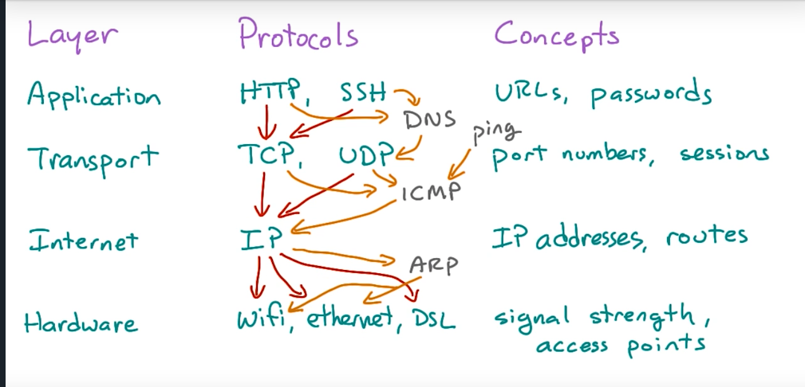

# Study Notes
***
## Algorithms for Interview
### Heap

Heap is a collection of implementations such as **priorityQueue** in Java and **heapq** in python. They are both min Heap by default. Heap is best used to dynamically find the Min/Max of a set.
***

## HTML

### Figure
A good template to insert a figure is as follows:
```
<!-- Figure with figcaption -->
<figure>
  
  <figcaption>MDN Logo</figcaption>
</figure>
<p></p>
```
### Form
- Input types: button, text, radio... More details can be found [Here](https://developer.mozilla.org/en-US/docs/Web/HTML/Element/input)
***

## Network Basics

### Terminology
- Packet: network traffic unit, a short message with sender and recipient info.
- port: a server has many ports. Common ones are 22 for SSH, 80 for HTTP. Port _1-1023_ are for local root user who can use `sudo` and _1024-65535_ are for external clients. One port can only be listened by one process at a time using `nc`, but programs can use threads to process multiple ports
- IP address: each computer connected to Internet has a unique IP address. Local host IP address is _127.0.0.1_.
- TCP: transmission control protocol
    - a layer below HTTP
    - It’s like a two-way road
    - only a client can initiate a connection but either ends can drop a connection by using _EOF_
- Layering 
### Some useful commands
- `ping -c3 8.8.8.8`. Here we try to get three lines of response from IP address 8.8.8.8 that is a server of Google
- `sudo lsof -i` lists programs that are listening on the network
- `nslookup $webpage` finds out the IP address of a certain website.
- `printf` prints formatted text. Compare with `echo`.
- `nc` stands for netcat. It connects to a port and send a string over
- `|` stands for pipe. `left | right` means take the output of _left_ and feed it into the input of _right_.
- `>` is the shell redirecting operator. `$content > example.txt` will send the output to the text file named _example.txt_.
***
## Python
## Some nice libraries
- webbrowser: interact with web browser using Python
- turtle: draw some patterns on screen
- twilio: send text
- [Python built-in library](https://docs.python.org/2/library/functions.html). Don't have to import any library.
    - open: used to open a text file
- urllib
    - urllib.urlopen(URL): create an object for opening the url
    - url object can read response:
        - obj.read() : this returns a string. Don’t forget to close the connection: obj.close()

## OOP
- `__init__`
    - double underscore means the function is reserved and special for Python always contain self —> the instance being created.
- class variable
    - shared with all the functions of the class. Use all uppercase to define class variable because it is unlikely to change. All built-in classes have `__doc__`, which can be be created by “””content””” at the beginning of the class
    - `__name__`: name of the class
    - `__module__`: name of the module where the class resides.
- Inheritance
    - To define child class:
    ```
    class Child(
        	def class Child(Parent):
        		def __init__(self, parentX, parentY, childX):
        			self.__init__(ParentX, ParentY)
        			self.childX = childX
    ```
    - If the child has conflicting methods with the parent, the child functions override parent methods.

### README.md
A README file usually contains the following parts:
1. project name
2. description
3. optional: links to external documentation
4. install instruction
5. common usage or known bugs
6. Contributions
7. License
***
