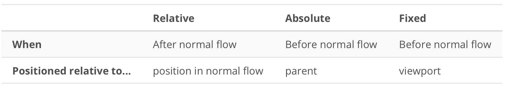

# Study Notes
***
Use **Ctl+Sft+m** to turn on markdown preview in Atom.
## Algorithms for Interview

### Common Data Structure

#### Heap
Heap is a collection of implementations such as **priorityQueue** in Java and **heapq** in python. They are both min Heap by default. Heap is best used to dynamically find the Min/Max of a set. functions: `heapq.heappush(h, item)`, `heapq.heappoll(h, item)`, `heapq.heapify(list)`. `heap[0]` is the min of the heap.

#### Heap vs. Stack
Objects provide facilities for polymorphism, are passed by reference (or more accurately have references passed by value), and are allocated from the heap. Conversely, primitives are immutable types that are passed by value and are often allocated from the stack.

### Common Templates
#### Single pointer
Shift pointer and check at each index if condition is met.
- strStr

#### Combination/Permutation Template
- Use DFS. Need to review DFS
- Common template: subset

#### Binary Search
When to use:
- when having XXXOOOO situation, and need to find the last index (or the first) that meets a condition.
- when a list can be partitioned by certain characteristics, i.e. slope increases/decreases or greater/smaller than the last item in a rotated sorted list.
Sometimes need to draw a graph for simply illustrate.

#### Binary Tree
resursion:
- divide and conquer
    - find what the children will return and see if you can combine their return results with the root
- traverse:
    - pass down a vessel from root to children and see if children can modify the vessel. The vessel is compared to a global variable at each layer.
	    1. define global variable
	    2. use helper function
	    3. in helper function, check exit condition. Then update global variable.
	    4. Then pass down helper function to children.

    - serialization/deserialization
    - pre-order, in-order traversal & reverse traversal
    - all tree paths
    - chiral tree
    - check if two trees are the same
    - check if B is subtree of A
    iteration:
    - need to memorize template
- in-order traversal of BST is a non-descending series.

#### Breath-first search
- Applications: 
    - Tree level order traversal. use for loop within the while(!queue.isEmpty()) to traverse through the levels. Make sure the size is fixed for the for loop iterator. Also similar is tree serializaiton. 
    - Graph traversal. Given one vertex and find all vertices connected to that vertex. Need to store all the connection information in a hash table (dict) before the queue while loop.
    - Find a/all closet node on a graph that meets certain condition. To find all closet nodes you need to use a for loop within the while loop.
    - Topological sort. Not numeric sort. Essentially it's just level order traversal on a directed graph. Topological sorting express dependence of elements. Need to calculate in-degree. Whenever the ancester is called, the children's indegree--. Add nodes to queue when their indegree is 0.
    - matrix/chessboard problem: change the original matrix values to make it easier to proceed.
- 
    1. Confusion: operations can be done either after dequeueing or before enqueuing.
    2. When to use for loop when not

#### Sorting
- Insertion sort
```
i ← 1
while i < length(A)
    j ← i
    while j > 0 and A[j-1] > A[j]
        swap A[j] and A[j-1]
        j ← j - 1
    end while
    i ← i + 1
end while
```
- Heap Sort
    - A **complete binary tree** is a binary tree in which every level, except possibly the last, is completely filled, and all nodes are as far left as possible. A **Binary Heap** is a Complete Binary Tree where items are stored in a special order such that value in a parent node is greater(or smaller) than the values in its two children nodes.
    - Time complexity of heapify is O(Logn). Time complexity of createAndBuildHeap() is O(n) and overall time complexity of Heap Sort is O(nLogn).


***
## HTML&CSS

### Basic Concepts
- HTML id's should be used sparingly because each element can only have one id and each page can only have one id.
- classes can be used more flexibily - each element can have multiple classes and each class can be used on multiple classes. Use of classes is preferred over that of id's.
- CSS properties to
    - italicize text: `font-style: italic;`
    - underline text: `text-decoration: underline;`
    - uppercase: `text-transform: uppercase;`
    - bold text: `font-weight: bold;`
    - add border: `border-style: dashed;`
    - make cursor pointer on hover: `cursor: pointer;`
    - box shadow: `box-shadow: 10px 10px grey;` (10pxs are horizontal and vertical shadows)
    - font family: `font-family: "arial", "serif"`; The broswer renders in priority from left to right
    - rounded border corners: `border-radius: 5px;`
    - `backgorund-image: url($linkToImage);`
- ways to express color:
    1. `background-color: rgb(255,0,255);`
    2. `background-color: #ff00ff;`
- semantic elements are a lot more informative than just plain _div_
    - `box-sizing: border-box;` contians content, padding and border
    - By default, headers have large fonts and margins, but no padding
    - The width of block elements is as big as the parent element allows. The height of block element take as little height as possible.
    - **inline elements** (such as span, p) are content-based, i.e. can only be as wide as the content inside the box is allowed. Cannot set width and height of inline elements. You can add margin and padding to inline elements but they only push other elements horizontally not vertically. **inline-block** takes on the layout behaviors of an inline element with the sizing behaviors of a block element.
    - _anonymous boxes_ are elements created from tabs, spaces and newlines in HTML.
    - `aside` element represents a side bar
- Positioning
    - **Relative positioning** moves the item to a position relative to where it's supposed to be originally. The neighboring items are not affected.
    - **z-index** resolves the overlapping issue by assigning weights to overlapping items. The one with the highest weight will be visible to user.
    - **document** aka DOM is the whole page, **viewport** aka **window** is the visible part of the DOM.
    - Three types of positioning:  Items being absolutely positioned are ignored from the normal flow. Absolute positioning is rarely used and considered the last resort.
    - text alignment:
        - `text-align: center`: align center horizontally
        - `vertical-align: text-top/middle/top`: different alignment options
        - `display: inline-block` creates many possible glitches for alignment. Better not use.
    - **floats**
        - different kind of flow from normal flow
        - floats stack on one another in the order that they appear in HTML
        - Regardless of float: left or float: right, all floats respect each other's space
        - Floated elements stay within their containers width, but not their height.
        - to clear float, define `clearfix:after` at the parent box such that the float effect will be cleared after being used.
    - overflow
        - used when child box is larger than parent box
        - `overflow: visible, scroll, hidden, auto`
- Responsive design
    - device returns **dip** (device independent pixel) instead of hardware pixels.
    -  `<meta name="viewport" content="width=device-width, initial-scale=1">` makes dip# the same as CSS pixel#.
    - to prevent _img/embed/object/video_ elements from overflowing from the container, use `max-width: 100%`;
    - tap target (buttons, nav, a) should be bigger than average figure. Make it `min-width: 48px; min-height:48px;`
    - media query: add a link to reference media attribute: `<link rel="" media="screen and (min-width: 500px)" href="somesheet.css">` or add media type:
    ```
	    @media screen and (min-width: 500px) {
	    	body {
	    	some statement;
	    }
    ```
    Most commonly used criteria are min-width and max-width. Don't use min-device-width because it doesn't allow for resizing.
    - breakpoints are decided based on the content by trial and error.
    - flex containers
        - `display: flex` and `flex-wrap: wrap`
    - flex item
- boostrap
    - `hr` must be wrapped in a `row` or a `col` element in order to follow boostrap grid.  

### Figure
A good template to insert a figure is as follows:
```
<!-- Figure with figcaption -->
<figure>
  
  <figcaption>MDN Logo</figcaption>
</figure>
<p></p>
```
### Form
- Input types: button, text, radio... More details can be found [Here](https://developer.mozilla.org/en-US/docs/Web/HTML/Element/input)
***

## Shell commands
- `curl` stands for _seeURL_ and can be used to download webpage: `curl -o $filename.html -L $url`
- `less` shows a text file one full-page at a time. `cat` displays all content at once.
- `|` stands for pipe. `left | right` means take the output of _left_ and feed it into the input of _right_.
- `>` is the shell redirecting operator. `$content > example.txt` will send the output to the text file named _example.txt_.
- `grep` is used to search for a keyword in a file. E.g. `curl -L 'someURL' | grep keyword | less`. `grep` has an option **-c** that counts the occurence of incidents.
- `touch $filename` to create a file.
## Network Basics
- name variables using `variablename='some string`. No space around "=". To call it, use `$variablename`.
    - shell variable, applies to the current instance of the shell. e.g. `$LINES`
    - environment variable, i.e. `$PATH`
- all the default paths are stored at `.bash_profile`
- alias: make frequently used long commands shorter. `alias shortCommand='longCommand'`


***

## Version Control
- version control system (VCS) = source code manager (SCM)
- git is a version control tool, while github is a service that hosts git projects. Git has local repos and github has remote repos.
- git working directory contains files that can be viewed when you open a code editor. This is different from linux current working directory.
- work flow
    1. edit files in working directory
    2. move the changed files to staging index
    3. save them to repository
- different version of updates are saved in the repo.
- Not a good idea to have nested git repositories. So make sure the terminal's current working directory isn't located in a Git repository.
- `git log --oneline` displays SHA and message only. `git log --stat` displays which file was modified. `git log --patch [SHA#]` shows the acutal code changed. If SHA is typed, the git change associated with SHA# is shown first. `git show $SHA` shows the commits given SHA.
- ignore certain files, add their name in `.gitignore`.
- `git tag` can be used to label specific versions. e.g. `git tag -a v1.0`. Here _a_ indicates annotation, which tells the person who made the tag the date the tag was made
a message for the tag.
- `git checkout -b $new-branch` creates a new local branch.
- `git diff` check the diff between current working directory and the repo.
- `git branch -D sidebar` force-deletes a branch, "d" only deletes a branch if it doesn't contain unique information.
- `git remote -v` displays the URL of the remote repo. It's possible to have links to multiple different remote repositories.
Origin is a shortname that's used to refer to the master remote repository's location. Typically the location is a URL, but it could be a file path on the same computer. `git remote add` is used to add a connection to a new remote repository.
- `git push origin master` is used to send commits from a local repo to a remote repo. 
- `git pull origin master` merges the local branch with the tracking branch. But if there are commits on the remote repo that you don't have locally AND there are commits in the local repo that remote repo doesn't have, then use `git fetch`
- `git fetch` retrieves commits from a remote repo but it doesn't merge commits from local repo. `git merge origin master` merges local branch with remote branch.
- `git shortlog` displays an alphabetical list of names and the commit messages that go along with them. If we just want to see just the number of commits that each developer has made, we can add a couple of flags: `-s` to show just the number of commits (rather than each commit's message) and `-n` to sort them numerically (rather than alphabetically by author name).
- `git log --grep $keyword` will show only the commits that contain certain keywords
- origin == my fork, upstream == source repo.
- _squashing_: combine commits together
- `git rebase -i HEAD~3` will combine the last three commits and create a new branch. 

***

## Network basics
### Terminology
- Packet: network traffic unit, a short message with sender and recipient IP addresses and their port numbers. IP addresses distinguish computers; port numbers distinguish program on those computers.
- port: a server has many ports. The URI scheme tells what port number you need to access. e.g. http - 80, https - 443, SSH - 20. Port _1-1023_ are for local root user who can use `sudo` and _1024-65535_ are for external clients. One port can only be listened by one process at a time using `nc`, but programs can use threads to process multiple ports
- IP address: each computer connected to Internet has a unique IP address. Local host IP address is _127.0.0.1_. The IPv6 address is just ::1.
- TCP: transmission control protocol
    - a layer below HTTP
    - It’s like a two-way road
    - only a client can initiate a connection but either ends can drop a connection by using _EOF_
- Layering 
### Some useful commands
- `ping -c3 8.8.8.8`. Here we try to get three lines of response from IP address 8.8.8.8 that is a server of Google
- `sudo lsof -i` lists programs that are listening on the network
- `nslookup $webpage` returns the IP address of the DNS server and finds out the IP address of a certain website. `host $webpage` does the same thing.
- `printf` prints formatted text. Compare with `echo`.
- `nc` stands for netcat. It connects to a port and send a string over

### Request and Response
- Server: A server is just a program that accepts connections from other programs on the network.
- URL is just a URI for a resource on the network. A URI has three parts: 
    - scheme: e.g. http, https, file. Https differs from http for its encription feature.
    - hostname: e.g. www.google.com or localhost. Usually hostname follows scheme by **://**. **:** belongs to scheme and **//** belongs to hostname.
    - path: which identifies a particular resource on a server. **/** is the root path.
    - other parts: 
        - fragment: the part of the URI after **#**. The browser doesn't send it to server. It just point to a specific part of a resource by `id`.
- hostnames are converted to IP address by OS network config using Domain Name Service (DNS)/
- http request: "verb path protocol" 
    - `GET` request, which client uses to ask the server to send a resource. e.g. `GET /readme.png HTTP/1.1`. How to use: ncat to a host and issue get request, type _enter_ twice. From the response, the **status line** tells the client whether the server understood the request, whether the server has the resource the client asked for, and how to proceed next. 2xx code means success, 3xx code means redirection, 4xx code means client error, 5xx code means server error.
- http response: "headers body"
    - **headers** are lines of metadata that start with a keyword such as __location__ followed by a colon and a value. **cookies** are web features that lets servers store data on the browser. A server sends the `Set-Cookie` header and broswer will send the cookie back in a `Cookie` header on subsequent requests. 
    - If getting 200 ok, body contains data. Incase of an error, error message is shown in body. 
- Post-Redirect-Get design pattern
    - A client POSTs to a server to create or update a resource; on success, the server replies not with a 200 OK but with a 303 redirect. The redirect causes the client to GET the created or updated resource.
    - One big advantage of Post-Redirect-Get is that as a user, every page you actually see is the result of a GET request, which means you can bookmark it, reload it, and so forth — without ever accidentally resubmitting a form.


### Python http.server
- HTTPServer class
- request handler class
- .encode(): 
    - If you want to send a string over HTTP connection, you have to encode the string into a **bytes object**. UTF-8 is an encoding method that converts characters in diff languagse in to byte objects.  
- URL Quoting aka URL encoding, which means translating a string into a form that doesn't have any special characters in it, but in a way that can be reversed (unquoted) later. " " are translated to "+". Other special characters are translated into hexadecimal codes that begin with the percent sign (%xx).
- HTML form `action` is the URI to which the form fields will be submitted.
- Idempotent. An action is idempotent if doing it twice (or more) produces the same result as doing it once.
- `POST` sends the form data in the request body, underneath the headers. The request also includes Content-Type and Content-Length headers. POST is not idempotent.

### Python Requests
- Python module for client side programming
- To get the data sent from server after get request, use `r.content` for literal binary data and `r.text` for string. If the `requests.get` call can reach an HTTP server at all, it will give you a Response object. If the request failed, the Response object has a `status_code` data member — either 200, or 404, or some other code.
But if it wasn't able to get to an HTTP server, for instance because the site doesn't exist, then `requests.get` will raise an exception.

### http in real world
- A server needs a static IP address and needs to allow incoming connections. 
- Concurrency: being able to handle two ongoing tasks at the same time, which the basic http.server.HTTPServer doesn't have. Python standard library supports doing this by adding a mixin to the HTTPServer class. A mixin is a sort of helper class, one that adds extra behavior the original class did not have.
- Request routing aka reverse proxying is a special server dispatches requests to the particular backend servers that need to handle each reques. 
- caching: 
    - browser cache, e.g. images from recently-viewed web pages
    - web proxy that performs caching for many users
    - reverse proxy used by websites
- Cookies are a way that a server can ask a browser to retain a piece of information, and send it back to the server when the browser makes subsequent requests. Every cookie has a key and a value. Cookies are used by analytics and advertising systems to track user activity from site to site. Cookies are also sometimes used to store user preferences for a site. 
- HTTPS: follows security protocol called **Transport Layer Security**.
***

## RDB
- Primary keys uniquely identifies rows in a table. Have to make sure the keys are unique and all rows have their own keys.

### SQL
- SQL comments start from `--`
- data types: integer, text, date(YYYY-MM-DD). Need to put '' around text and date types. 
- `*` selects all columns.
- operators: not, and, or, !=
- select clauses: 
    - `limit $count [offset $skip]` Return just the first count rows of the result table starting after the first skip rows.
    - `order by $columns [Desc]`. Sort the rows using the columns (one or more, separated by commas) as the sort key.
    - `group by columns`. Only work with aggregations such as max, count, and sum and change their behaviours. With group by, the aggregation will return one row for each distinct value in columns. e.g. `select name, count(*) as num from animals group by name`. This will group animals by name, find the count for each name, and display the names and counts.
    - `where` is a restriction on the source tables; `having` is a restriction on the result, after aggregation. 
- Insert a row: `insert into table values(xx, yy[, zz])`. 

### DB-API
- standard python library allowing for communication between python and db. 
- `select`, use `cursor` to execute and fethc results. 


### PostreSQL
- `\dt` — list all the tables in the database. `\dt+` — list tables plus additional information (notably, how big each table is on disk). `\H` — switch between printing tables in plain text vs. HTML.
- `insert`, use `conn` to commcit and rollback. e.g. `insert into $table values ('$somevalue'[, *args])`
- whenever you execute an insert query make sure to use query parameters instead of string substitution to avoid SQL injection attack. The Python string operator % must not be used: the execute() method accepts a tuple or dictionary of values as second parameter. Never use % or + to merge values into queries.
- **script injecting attack**: when a piece of JS code is ordering browser do undesirable things.

***
## Python
### Some nice libraries
- webbrowser: interact with web browser using Python
- turtle: draw some patterns on screen
- twilio: send text
- [Python built-in library](https://docs.python.org/2/library/functions.html). Don't have to import any library.
    - open: used to open a text file
- urllib
    - urllib.urlopen(URL): create an object for opening the url
    - url object can read response:
        - obj.read() : this returns a string. Don’t forget to close the connection: obj.close()
- `dict` has a method `.get($key[, $defaultValue])` so if key doesn't exist then return default value. It's a more concise way than dict[key].
- `sorted(list, key=lambda x: x[column])` sort by column.


### OOP
- `__init__`
    - double underscore means the function is reserved and special for Python always contain self —> the instance being created.
- class variable
    - shared with all the functions of the class. Use all uppercase to define class variable because it is unlikely to change. All built-in classes have `__doc__`, which can be be created by “””content””” at the beginning of the class
    - `__name__`: name of the class
    - `__module__`: name of the module where the class resides.
- Inheritance
    - To define child class:
    ```
    class Child(
        	def class Child(Parent):
        		def __init__(self, parentX, parentY, childX):
        			self.__init__(ParentX, ParentY)
        			self.childX = childX
    ```
    - If the child has conflicting methods with the parent, the child functions override parent methods.

## README.md
A README file usually contains the following parts:
1. project name
2. description
3. optional: links to external documentation
4. install instruction
5. common usage or known bugs
6. Contributions
7. License
***
